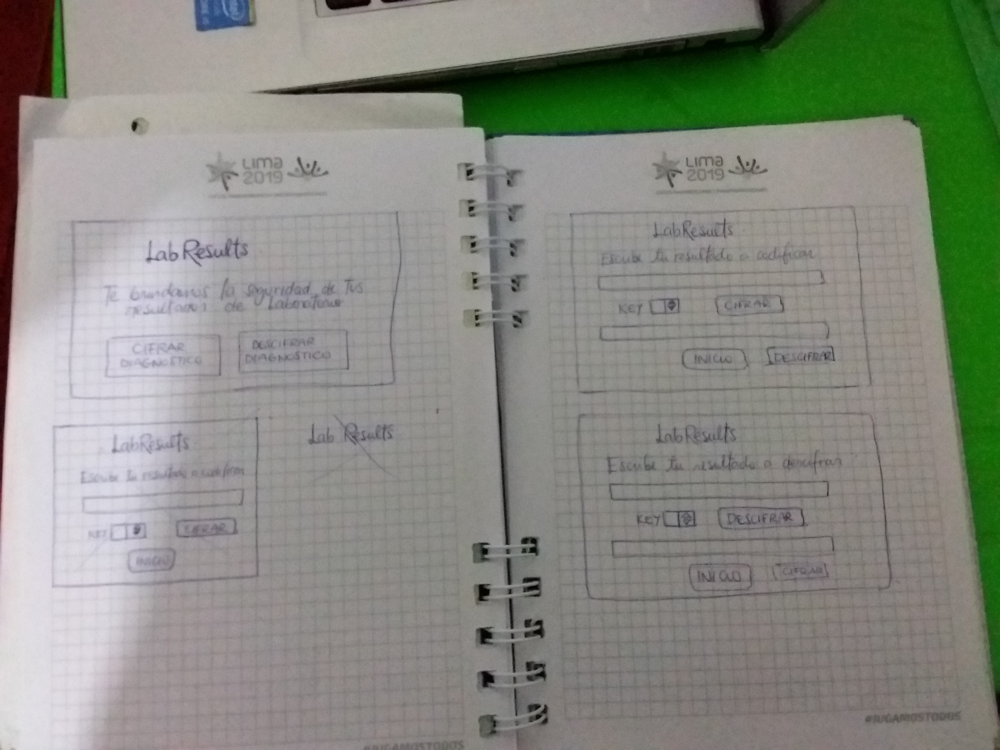


##**LabResults** 
***
  LabResults es una app para cifrar y descifrar diagnósticos a los resultados de examenes medicos hechos en Laboratorios. Le ofrecemos la seguridad de su información medica que sera cifrada y descifrada a través de una clave o número de desplazamientos.

  

  1. Para esta app tendriamos dos usuarios: los laboratorios y los pacientes que acuden a estos.
     
  2. La app solucionaría el riesgo de seguridad que existe cuando se entregan resultados por parte de los laboratorios, ya que en la mayoría de casos se entrega una impresión en papel que puede ser vulnerada facilmente. Sin embargo la aplicación se centra sobretodo en casos donde los examenes son de enfermedades crónicas o de extremo cuidado (ADN, VIH-SIDA, ETS, TBC, etc) porque la divulgación de esta información afectaría directamente la vid del paciente. 

  3. 

  4. Feedback
     * Me sugirieron cambiar el mensaje en la pagina de Inicio para que sea más clara la descripción de la app
     * El botón de Clave no solo sea editable sino sea un botón que aumente o reduzca la numeración.

  5. Imagen del prototipo final.
    

