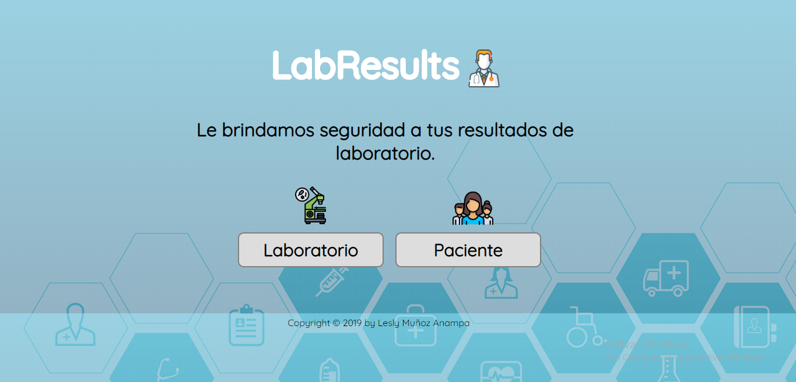


# **LabResults** :microscope:
***
  LabResults es una app para cifrar y descifrar diagnósticos a los resultados de examenes medicos hechos en Laboratorios. Le ofrecemos la seguridad a la información medica que sera cifrada y descifrada a través de una clave o número de desplazamientos.

  

  + Para esta app tendriamos dos usuarios: los laboratorios y los pacientes que acuden a estos.
     
  + La app solucionaría el riesgo de seguridad que existe cuando se entregan resultados por parte de los laboratorios, ya que en la mayoría de casos se entrega una impresión en papel que puede ser vulnerada facilmente. Sin embargo la aplicación se centra sobretodo en casos donde los examenes son de enfermedades crónicas o de extremo cuidado (ADN, VIH-SIDA, ETS, TBC, etc) porque la divulgación de esta información afectaría directamente la vida del paciente. 

  + Feedback
     1. Me sugirieron cambiar el mensaje en la pagina de Inicio para que sea más clara la descripción de la app
     2. Ser más clara con los botones de la pagina inicial, es decir en vez de cifrado y descifrado colocar el público al    que era dirigido, en este caso: laboratorios y pacientes.
     3. El botón de Clave no solo sea editable sino sea un botón que aumente o reduzca la numeración.

  + Imagen del prototipo final.

    ![Imagen 1][1]  ![Imagen 2][2]  
          ![Imagen 3][3]

 [1]: protot-1.png 
 [2]: proto-2.png  
 [3]: proto-3.png 

## Objetivos de aprendizaje Cipher

A continuación te presentamos los objetivos de aprendizaje de este proyecto. Reflexiona y luego marca los objetivos que has llegado a **entender** y **aplicar** en tu proyecto.

### UX

- [x] Diseñar la aplicación pensando y entendiendo al usuario.
- [x] Crear prototipos para obtener feedback e iterar.
- [x] Aplicar los principios de diseño visual (contraste, alineación, jerarquía).

### HTML y CSS

- [x] Uso correcto de HTML semántico.
- [x] Uso de selectores de CSS.
- [x] Construir tu aplicación respetando el diseño realizado (maquetación).

### DOM

- [ ] Uso de selectores del DOM.
- [x] Manejo de eventos del DOM.
- [x] Manipulación dinámica del DOM.

### Javascript

- [ ] Manipulación de strings.
- [x] Uso de condicionales (if-else | switch).
- [ ] Uso de bucles (for | do-while).	
- [x] Uso de funciones (parámetros | argumentos | valor de retorno).
- [ ] Declaración correcta de variables (const & let).

### Testing
- [x] Testeo de tus funciones.

### Git y GitHub
- [x] Comandos de git (add | commit | pull | status | push).
- [x] Manejo de repositorios de GitHub (clone | fork | gh-pages).

### Buenas prácticas de desarrollo
- [ ] Uso de identificadores descriptivos (Nomenclatura | Semántica).
- [x] Uso de linter para seguir buenas prácticas (ESLINT).
